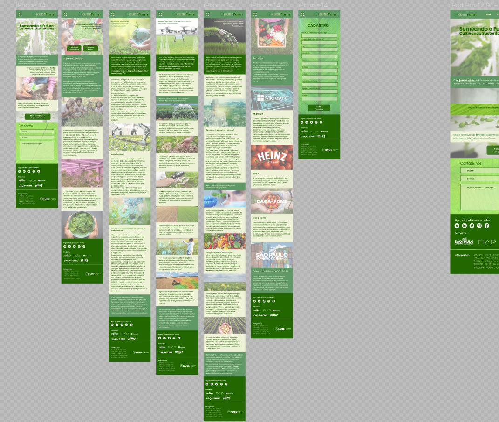

# KubeFarm

Print de parte do Figma do projeto KubeFarm (formato mobile). O html e css foram desenvolvidos com responsividade pelo conceito de mobile-first, utilizamos como
 referência os protótipos de modelo de iphone 12 pro (390 x 844) para fazer o responsivo em formato de celular, modelo de ipad pro (1024 x 1366) e por fim desktop com telas acima de 1440💻

 

<b>
<h1>Sobre o projeto</h1>
A Kube Farm tem como objetivo fomentar o acesso de pessoas a
uma dieta alimentar saudável, natural e livre de agrotóxicos, seja para escolas
públicas, comunidades carentes, quilombolas, regiões afetadas pelo clima ou de
extrema pobreza, através da agricultura inteligente (também denominada agricultura
5.0).  
Nosso projeto consiste na instalação de containers-estufas providos de
inteligência artificial com sistema de controle otimizado de rotinas para irrigação,
temperatura, umidade e luminosidade para plantio indoor de vegetais, tubérculos e
hortaliças.
O fornecimento energético se dará através de painéis solares fotovoltaicos e
o abastecimento de água a partir da ligação de um ponto de água comum fornecido
pela rede de abastecimento local ou em casos específicos, por meio de cisterna de
captação de água pluvial. Vale ressaltar que tanto a energia elétrica quanto a água
utilizadas na produção serão usadas de maneira precisa, racional e econômica, uma
vez que todo o processo de irrigação e energia será automatizado e controlado por
IA.  
Com a ajuda de softwares de gestão, sensores e sistemas de automação, é
possível traçar um planejamento estratégico para o desenvolvimento dos espécimes
vegetais, garantindo que nenhum detalhe passe despercebido pela supervisão de
agrônomos e biólogos do projeto. De forma remota controlar a incidência de luz e
água adequada para cada espécie plantada. E ainda a fim de atingir melhores
resultados, caberá a um ou mais responsáveis da comunidade local (sendo esse
devidamente capacitado pelo Projeto), a manutenção mínima exigida, como
eventual troca de solo, limpeza do local e equipamento quando necessário.
A fazenda indoor não seria afetada por variação climática e a compacticidade
do container possibilita sua instalação em terrenos de proporções limitadas,
garantindo assim que a produção de alimentos seja de forma contínua e
ininterrupta.  
As hortaliças produzidas em uma fazenda vertical podem ser consumidas
poucas horas ou mesmo minutos após colhidas. Quando o próprio local de
produção se torna o local de comercialização e até mesmo, de consumo,
liquidam-se a alta incidência de folhas e frutos danificados e as perdas pós-colheita
que para algumas hortaliças, podem alcançar até 50% do volume colhido.
A proposta de um modelo de produção de hortaliças frescas e nutritivas, ao
alcance imediato dos consumidores e localizado em grandes centros urbanos
alinha-se, dessa forma, a alguns dos Objetivos de Desenvolvimento Sustentável das
Nações Unidas, entre eles o ODS nº11, que versa sobre cidades e comunidades
mais resilientes e sustentáveis.

## KubeGame
Esse programa usou de lógica de programação e consiste em um jogo interativo para divulgação e popularização do projeto KubeFarm. Assim como qualquer projeto social, o KubeFarm necessita da maior quantidade possível de pessoas engajando, contribuindo, compartilhando e apoiando o projeto. O KubeGame nasceu dessa necessidade e, para obter procura e potencial de compartilhamento, oferece brindes e um prêmio final ao jogador que finalizar o game com um bom score. Por meio do jogo, conseguimos captar informações do usuário e aproveitamos para realizar uma breve abertura de assuntos que estão relacionados ao nosso projeto. O jogo será disponibilizado em períodos específicos de tempo, de acordo com a estratégia de marketing do projeto.

## Etapas e detalhes
O kubeGame se trata de um jogo que, além de captar informações do usuário, também tem como objetivo a apresentação do projeto e uma breve conscientização dos seu temas-origem. Portanto, é um sistema que usa de explicações detalhadas a respeito das etapas e intenções do sistema no geral. Por isso, começamos o programa com explicações - essas tanto para o analista do sistema, por meio de comentários, quanto para o usuário (por meio do print()).

O jogo é divido em três etapas:

a fase de concessão de informações e autorização de envio de e-mails informativos;
a de teste de conhecimentos (quiz) em torno da ODS2 (base da criação da nossa proposta de solução);
a do Jogo da Forca - que implementa no imaginário do usuário, de forma interativa, os conceitos/palavras/valores relativos ao KubeFarm.
A primeira fase é crucial para conseguir gabaritar o jogo. A concessão da autorização para receber e-mails informativos conta três pontos de sete ao score do usuário, e isso lhe é informado antes do input de concessão. O nome e e-mail são validados por expressões regulares (nome precisa de mais de um, por precisar ser completo; e-mail precisa de no mínimo um '@' e um '.').

A segunda fase (KubeQuiz) concede, por si só, a possibilidade de adquirir brindes. O usuário deve responder três questões, cada uma com três opcões de 1 a 3. Cada opção acertada garante um brinde por si só.

A terceira (KubeForca) é executada três vezes e cada um de seus rounds vale um ponto. O usuário é orientado a digitar uma letra por vez a fim de acertar uma palavra. Por si só, essa fase não oferece brindes: apenas computa os pontos para a possibilidade de conseguir o prêmio final no caso de o usuário acertar todas. Caso isso aconteça, o usuário ganha o brinde da segunda fase e o prêmio final (cesta orgânica no valor de R$80.)

Todas as fases validam input por meio de estruturas de repeticão. No KubeQuiz, a estrutura é implementada dentro de uma funcão com parâmetros (questao, opcoes, gabarito).

Todas as fases são chamadas no programa principal. Ao final, este informa ao usuário se ele(a) conseguiu algum brinde ou prêmio e, caso não o tenha, explica o porquê.

O programa roda apenas uma vez, não oferecendo ao usuário a chance de refazer o jogo. A idéia é a de que, quando o jogo for implementado, o usuário realmente tenha que abrir o convite do KubeGame para iniciá-lo: dessa forma, é mais fácil existir um certo controle em torno de quantidade máxima de participação de no máximo uma pessoa por jogo.

